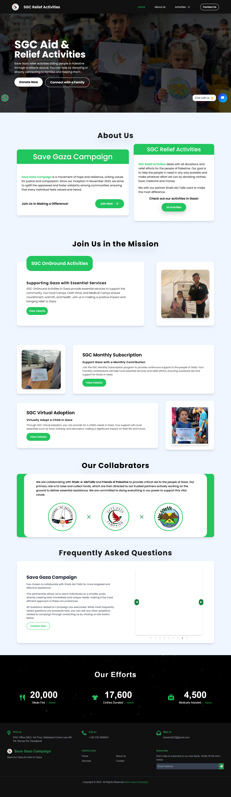
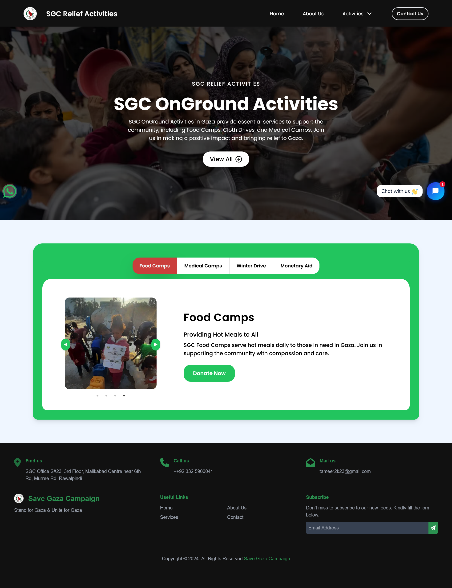
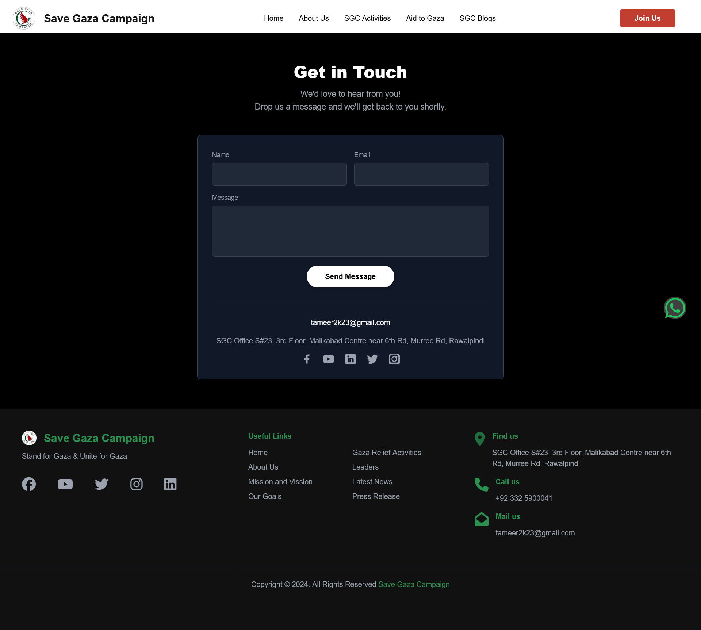
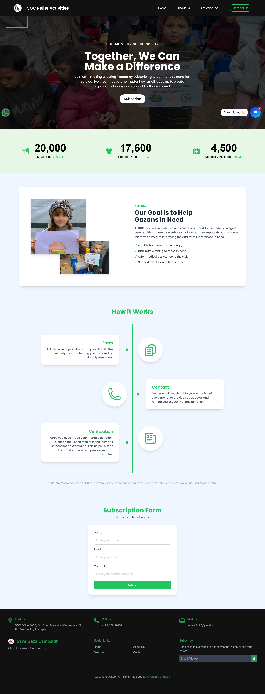

# Direct Aid Portal for SGC

A Direct Aid portal allowing people to donate and participate in charity for Save Gaza Campaign.

## Features

- **Responsiveness**
- **Whatsapp URL**
- **AI Cahtbot**
- **Counters**

## Known Issues

The application is fully functional with payment modules and forms made but archived due to client's change of plans. A Frontend heavy application made for SGC client.

## Deployment

https://www.savegazacampaign.org/

## How to Start

```bash

npm i
npm run dev

```

## Screenshots

### Homepage



### Landing


### Ground



### Contact



### Landing Page


### Subscription


